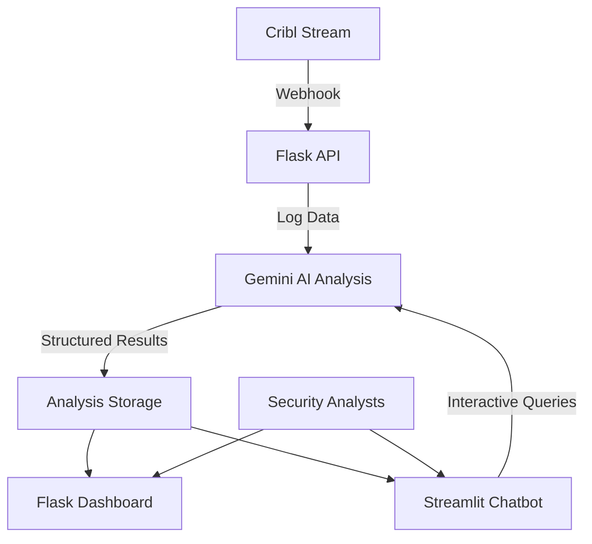

# 🛡️ AI-Powered Cribl Log Analysis Platform

[](https://python.org)
[](https://flask.palletsprojects.com/)
[](https://streamlit.io)
[](https://ai.google.dev/)
[](LICENSE)

A sophisticated, AI-driven log analysis platform that integrates seamlessly with **Cribl Stream** to provide real-time insider threat detection, predictive security analytics, and prescriptive incident response recommendations using Google's Gemini AI.

## 🌟 Features

### 🤖 **AI-Powered Analysis**
- **Predictive Analytics**: Identify patterns that may indicate future security incidents
- **Prescriptive Insights**: Get actionable recommendations and step-by-step response procedures
- **Real-time Processing**: Instant analysis of incoming log data from Cribl Stream
- **Structured Threat Assessment**: Standardized threat levels (LOW/MEDIUM/HIGH/CRITICAL) with risk scores

### 🔗 **Cribl Stream Integration**
- **Webhook Endpoint**: Seamless integration with Cribl Stream pipelines
- **Multiple Data Formats**: Supports JSON, plain text, and GZIP-compressed data
- **Automatic Processing**: Zero-configuration log ingestion and analysis
- **Real-time Dashboard**: Live monitoring of analysis results

### 🎯 **Insider Threat Detection**
- **Behavioral Analysis**: Detect unusual access patterns and privilege escalations
- **Anomaly Detection**: Identify deviations from normal user behavior
- **Risk Scoring**: Quantitative assessment of security threats (1-10 scale)
- **Contextual Intelligence**: Time-based and department-specific analysis

### 📊 **Dual Interface System**
- **Flask API Dashboard**: Professional web interface for technical teams
- **Streamlit Chatbot**: Interactive conversational interface for security analysts
- **Cross-Platform Synchronization**: Shared analysis results across both interfaces
- **Export Capabilities**: Download analysis results in JSON format

## 🏗️ Architecture Overview



### **Component Details**

1. **Flask API (`log_api.py`)**
   - Webhook receiver for Cribl Stream integration
   - AI analysis engine with structured parsing
   - Professional dashboard with real-time updates
   - Health monitoring and error handling

2. **Streamlit Chatbot (`streamlit_app.py`)**
   - Interactive conversational interface
   - Multiple Gemini model support (Flash, Pro, Standard)
   - Session memory and chat history
   - Quick-question templates for common scenarios

3. **AI Analysis Engine**
   - Google Gemini AI integration
   - Structured prompt engineering for consistent results
   - Safety settings for enterprise deployment
   - Error handling and fallback mechanisms

## 🚀 Quick Start

### Prerequisites

- **Python 3.8+**
- **Google Gemini API Key** ([Get one here](https://ai.google.dev/))
- **Cribl Stream** (for full integration)

### 1. Installation

```bash
# Clone the repository
git clone https://github.com/yourusername/Cribl_Log_API.git
cd Cribl_Log_API

# Install dependencies
pip install -r requirements.txt
```

### 2. Configuration

Create a `.env` file in the project root:

```env
# Gemini API Key - Required
GEMINI_API_KEY=your_gemini_api_key_here

# Flask Configuration
FLASK_DEBUG=False
PORT=5000

# Optional: Flask Secret Key
FLASK_SECRET_KEY=your_secret_key_here
```

For Streamlit deployment, create `.streamlit/secrets.toml`:

```toml
GEMINI_API_KEY = "your_gemini_api_key_here"
```

### 3. Running the Applications

#### Flask API Dashboard
```bash
python log_api.py
```
Access at: `http://localhost:5000`

#### Streamlit Chatbot
```bash
streamlit run streamlit_app.py
```
Access at: `http://localhost:8501`

## 🔧 Cribl Stream Integration

### Webhook Configuration

1. **In Cribl Stream**, create a new destination:
   - Type: `HTTP/HTTPS`
   - URL: `https://your-flask-app.com/log-to-chatbot`
   - Method: `POST`
   - Content-Type: `application/json`

2. **Pipeline Setup**:
   ```javascript
   // Example Cribl pipeline configuration
   {
     "id": "ai-log-analysis",
     "filter": "source.includes('security') || source.includes('auth')",
     "destinations": ["ai-webhook"]
   }
   ```

3. **Sample Log Format**:
   ```json
   {
     "timestamp": "2024-01-15T02:30:00Z",
     "user": "john.doe",
     "action": "file_access",
     "file_path": "/sensitive/financial_data.xlsx",
     "source_ip": "192.168.1.100",
     "department": "IT",
     "unusual_activity": "accessing sensitive files outside business hours"
   }
   ```

## 📡 API Endpoints

### Flask API

| Endpoint | Method | Description |
|----------|--------|-------------|
| `/` | GET | Health check and status |
| `/health` | GET | Detailed health information |
| `/dashboard` | GET | Web dashboard interface |
| `/log-to-chatbot` | POST/PUT | Webhook for log ingestion |
| `/test-ai` | POST | Test AI analysis functionality |

### Example Usage

```bash
# Test the webhook endpoint
curl -X POST http://localhost:5000/log-to-chatbot \
  -H "Content-Type: application/json" \
  -d '{
    "timestamp": "2024-01-15T02:30:00Z",
    "user": "test.user",
    "action": "login_failure",
    "attempts": 5,
    "source_ip": "unknown"
  }'
```

## 🧠 AI Analysis Capabilities

### Threat Level Classification
- **🟢 LOW (1-3)**: Normal activities with minor anomalies
- **🟡 MEDIUM (4-6)**: Suspicious patterns requiring monitoring
- **🟠 HIGH (7-8)**: Potential security incidents needing immediate attention
- **🔴 CRITICAL (9-10)**: Active threats requiring emergency response

### Analysis Components

1. **Predictive Analysis**
   - Pattern recognition for future threat prediction
   - Behavioral trend analysis
   - Risk probability estimation
   - Attack vector identification

2. **Prescriptive Analysis**
   - Immediate action recommendations
   - Step-by-step response procedures
   - Preventive measure suggestions
   - Long-term security improvements

3. **Structured Output**
   ```json
   {
     "threat_level": "HIGH",
     "risk_score": "8",
     "summary": "Multiple failed login attempts detected...",
     "key_findings": "- 15 failed attempts in 5 minutes\n- Source IP not in whitelist",
     "immediate_actions": "- Block source IP\n- Reset user credentials",
     "recommendations": "- Implement account lockout policies\n- Enable MFA"
   }
   ```

## 🎨 User Interfaces

### Flask Dashboard Features
- **Real-time Analysis Results**: Live updates of log analysis
- **Threat Level Indicators**: Color-coded threat classification
- **Expandable Log Views**: Detailed raw log examination
- **Auto-refresh**: Automatic page updates every 60 seconds
- **Responsive Design**: Mobile-friendly interface

### Streamlit Chatbot Features
- **Conversational Interface**: Natural language interaction
- **Model Selection**: Choose between Gemini models
- **Session Memory**: Persistent conversation history
- **Quick Questions**: Pre-built security analysis queries
- **Webhook Integration**: Automatic processing of Cribl Stream data
- **Results Dashboard**: Comprehensive analysis history

## 🛠️ Development

### Project Structure
```
Cribl_Log_API/
├── log_api.py              # Flask application
├── streamlit_app.py        # Streamlit chatbot
├── requirements.txt        # Python dependencies
├── .env                    # Environment variables
├── .streamlit/
│   └── secrets.toml       # Streamlit secrets
└── README.md              # This file
```

### Adding New Features

1. **Custom Analysis Prompts**: Modify the system prompts in both applications
2. **Additional Endpoints**: Extend the Flask API with new routes
3. **UI Enhancements**: Customize CSS styling in both interfaces
4. **Data Storage**: Implement persistent storage (Redis, PostgreSQL, etc.)

### Environment Variables

| Variable | Description | Required |
|----------|-------------|----------|
| `GEMINI_API_KEY` | Google Gemini AI API key | ✅ Yes |
| `FLASK_DEBUG` | Enable Flask debug mode | ❌ No |
| `PORT` | Flask application port | ❌ No |
| `FLASK_SECRET_KEY` | Flask session encryption key | ❌ No |

## 🚀 Deployment

### Local Development
```bash
# Development mode with auto-reload
export FLASK_DEBUG=True
python log_api.py

# Streamlit development
streamlit run streamlit_app.py --server.runOnSave true
```

### Production Deployment

#### Using Gunicorn (Flask)
```bash
gunicorn --bind 0.0.0.0:5000 --workers 4 log_api:app
```

#### Using Streamlit Cloud
1. Push to GitHub repository
2. Connect to [Streamlit Cloud](https://streamlit.io/cloud)
3. Add secrets in Streamlit Cloud dashboard
4. Deploy automatically

#### Using Docker
```dockerfile
# Dockerfile example
FROM python:3.9-slim
WORKDIR /app
COPY requirements.txt .
RUN pip install -r requirements.txt
COPY . .
EXPOSE 5000
CMD ["gunicorn", "--bind", "0.0.0.0:5000", "log_api:app"]
```

### Environment-Specific Configurations

#### Production
```env
FLASK_DEBUG=False
PORT=5000
GEMINI_API_KEY=prod_api_key_here
```

#### Staging
```env
FLASK_DEBUG=True
PORT=5001
GEMINI_API_KEY=staging_api_key_here
```

## 🔒 Security Considerations

### API Security
- **Environment Variables**: Secure API key storage
- **Input Validation**: Comprehensive request data validation
- **Error Handling**: Secure error messages without sensitive data exposure
- **Rate Limiting**: Implement request throttling for production

### Data Privacy
- **Log Sanitization**: Remove PII before AI analysis
- **Temporary Storage**: Analysis results stored in memory (non-persistent)
- **Secure Transmission**: HTTPS enforcement for webhook endpoints
- **Access Control**: Implement authentication for production deployments

## 📊 Monitoring and Observability

### Health Monitoring
- **Health Check Endpoint**: `/health` for monitoring systems
- **Logging**: Comprehensive application logging
- **Error Tracking**: Detailed error reporting and handling
- **Performance Metrics**: Request timing and AI analysis duration

### Analytics
- **Analysis Metrics**: Track threat levels and response times
- **Usage Statistics**: Monitor endpoint usage and user interactions
- **AI Performance**: Monitor Gemini AI response quality and errors

## 🤝 Contributing

We welcome contributions! Please follow these steps:

1. **Fork** the repository
2. **Create** a feature branch (`git checkout -b feature/amazing-feature`)
3. **Commit** your changes (`git commit -m 'Add amazing feature'`)
4. **Push** to the branch (`git push origin feature/amazing-feature`)
5. **Open** a Pull Request

### Development Guidelines
- Follow PEP 8 style guidelines
- Add comprehensive docstrings
- Include unit tests for new features
- Update documentation for API changes

## 🐛 Troubleshooting

### Common Issues

#### Gemini API Key Issues
```bash
# Check API key configuration
python -c "import os; print('API Key:', os.getenv('GEMINI_API_KEY')[:10] + '...')"
```

#### Webhook Connection Issues
```bash
# Test webhook endpoint
curl -X GET http://localhost:5000/log-to-chatbot
```

#### Streamlit Secrets Issues
```bash
# Verify secrets.toml location
ls .streamlit/secrets.toml
```

### Error Codes

| Error | Description | Solution |
|-------|-------------|----------|
| `401` | Invalid Gemini API key | Check API key in environment variables |
| `404` | Endpoint not found | Verify URL and routing configuration |
| `500` | Internal server error | Check application logs for details |

## 📚 Additional Resources

### Documentation
- [Google Gemini AI Documentation](https://ai.google.dev/docs)
- [Flask Documentation](https://flask.palletsprojects.com/)
- [Streamlit Documentation](https://docs.streamlit.io/)
- [Cribl Stream Documentation](https://docs.cribl.io/stream/)

### Security Best Practices
- [NIST Cybersecurity Framework](https://www.nist.gov/cyberframework)
- [OWASP Security Guidelines](https://owasp.org/)
- [Insider Threat Mitigation](https://www.cisa.gov/insider-threat-mitigation)

### AI and Machine Learning
- [Google AI Best Practices](https://ai.google/responsibility/responsible-ai-practices/)
- [Prompt Engineering Guide](https://www.promptingguide.ai/)

## 📝 License

This project is licensed under the MIT License - see the [LICENSE](LICENSE) file for details.

## 📞 Support

- **Issues**: [GitHub Issues](https://github.com/yourusername/Cribl_Log_API/issues)
- **Discussions**: [GitHub Discussions](https://github.com/yourusername/Cribl_Log_API/discussions)
- **Email**: your-email@example.com

## 🙏 Acknowledgments

- **Google Gemini AI** for providing advanced language model capabilities
- **Cribl Stream** for excellent log processing and routing
- **Streamlit** for the intuitive web application framework
- **Flask** for the robust API framework
- **Open Source Community** for the amazing tools and libraries

---

<div align="center">

**Built with ❤️ by [Your Name](https://github.com/yourusername)**

⭐ Star this repository if you find it helpful!

</div>
